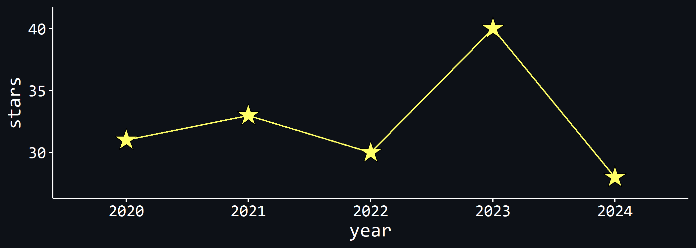
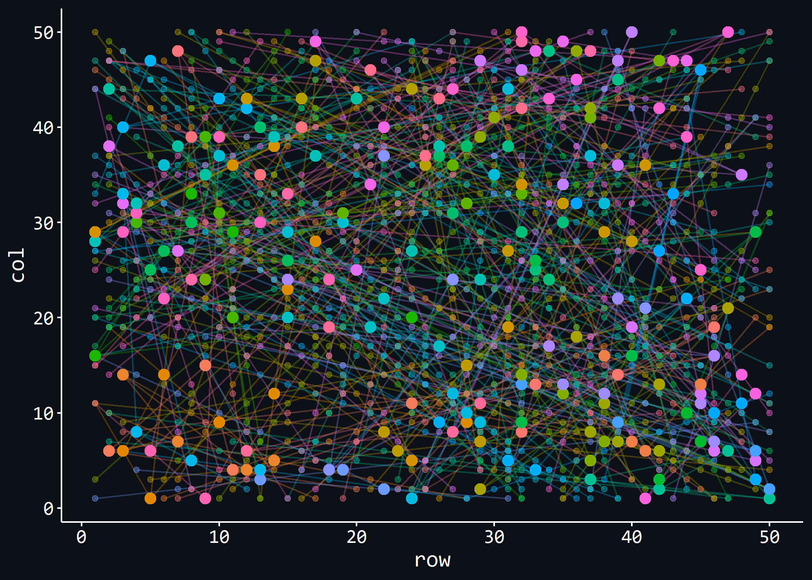

# Advent of Code 2024

This repo contains my solutions for the [Advent of Code
2024](https://adventofcode.com/2024) in `R`. This year, I’ll be taking
Posit’s new IDE [Positron](https://positron.posit.co/) for a spin! Watch
my stream (in German) [on Twitch](https://www.twitch.tv/einglasrotwein).

Here’s my past performance (and this year’s performance, so far):

Figure 1

## TOC

Here is a table of contents showing you what each day was about, along
with some stats. Completion time refers to the time it took me to
complete the puzzle since release (part 1, and part 2 in brackets), as
tracked on the Advent of Code website. Next is my rank for the puzzle on
that day (part 1 (part 2)), and finally the runtime of my code. It’s a
crude measure of runtime, where I simply calculate the difference in
`Sys.time()` at the beginning and the end of part 1, and the beginning
and end of part 2. That means in some occasions, the runtime for part 2
will be much shorter because part of the code needed to solve part 2 was
already run in part 1. Reading in the data (and sometimes, basic
preprocessing that has nothing to do with the puzzle solution) is
excluded from the run time calculations.

| Day | Title | Completion Time | Rank | Run Time |
|----|----|----|----|----|
| 1 | Historian Hysteria | 13:08:13 (13:16:14) | 70868 (66063) | 0.27 (1.33) ms |
| 2 | Red-Nosed Reports | 14:11:06 (14:17:57) | 88084 (64158) | 12.70 (34.26) ms |
| 3 | Mull It Over | 03:49:20 (05:05:54) | 36003 (34641) | 4.45 (3.29) ms |
| 4 | Ceres Search | 16:05:33 (16:26:25) | 69554 (62454) | 340.38 (241.18) ms |
| 5 | Print Queue | 15:47:12 (16:07:47) | 61726 (52059) | 10.62 (38.25) ms |
| 6 | Guard Gallivant | 15:27:28 (\>24h) | 55995 (56272) | 834.51 ms (40.94 min) |
| 7 | Bridge Repair | 14:39:46 (15:02:18) | 42939 (40270) | 12.8 ms (13.24 s) |
| 8 | Resonant Collinearity | 14:51:17 (15:10:42) | 40613 (38218) | 36.99 (44.58) ms |

## Plots

### Day 8 - Antennas and their antinodes

